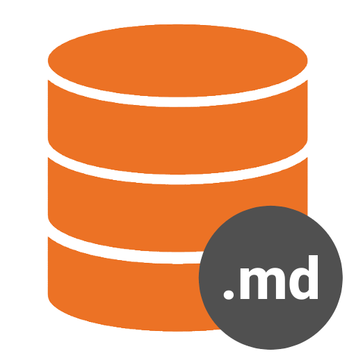

<p align="center">
  
</p>

<h1 align="center">Laravel Model Markdown Generator</h1>

<p align="center">
  <a href="https://turingcomplete.in">Website</a> •
  <a href="https://marketplace.visualstudio.com/items?itemName=TuringComplete.laravel-model-markdown-generator">Marketplace</a>
</p>

---

## Overview

Laravel Model Markdown Generator automatically documents your Laravel database structure by scanning models and migrations and converting them into clean, readable Markdown.

Perfect for onboarding, debugging, and helping AI/code assistants understand your schema instantly.

---

# My VS Code Extension


---

## Why This Exists

Understanding relationships in legacy Laravel projects is painful.
This extension removes the guesswork by generating a clear, structured overview of your database.

---

## What It Does

* Scans `app/Models` recursively for Laravel model classes
* Scans `database/migrations` recursively for table definitions
* Extracts table columns from `Schema::create(...)` migrations
* Extracts foreign keys using Laravel’s standard syntax
* Detects Eloquent relationships:

  * `hasOne`
  * `hasMany`
  * `belongsTo`
  * `belongsToMany`
  * `morphTo`
  * `morphOne`
  * `morphMany`
* Opens generated Markdown directly in VS Code

---

## Command

Open the Command Palette and run:

`Laravel: Generate Model Relationships Markdown`

The extension will analyze your current Laravel workspace and generate a Markdown document containing:

* Tables
* Columns
* Foreign Keys
* Eloquent Relationships

---

## Expected Laravel Structure

The extension expects a standard Laravel project layout:

* `artisan` at the workspace root
* Models inside `app/Models`
* Migrations inside `database/migrations`

If the workspace is not recognized as a Laravel project, the command will stop and show an error.

---

## Example Output

```md
# Database Documentation

## Table: posts

### Columns

- id (id)
- user_id (foreignId)
- title (string)

### Foreign Keys

- user_id -> users.id

### Eloquent Relationships

- belongsTo -> User
```

---

## Current Limitations

This extension is intentionally lightweight. Currently it:

* Assumes model table names using simple pluralization (`Post -> posts`)
* Does not evaluate custom `$table` properties or advanced pluralization rules
* Parses migrations based only on `Schema::create(...)`
* Supports standard Laravel foreign key syntax only
* Opens Markdown in editor instead of saving a `.md` file automatically

---

## Why Use It

* Quickly understand unfamiliar Laravel codebases
* Visualize database relationships without digging through files
* Generate documentation for teams or personal reference
* Improve context for AI tools and code assistants


## Contributing

Contributions, issues, and suggestions are welcome.

If you encounter a migration or relationship pattern that isn’t detected, open an issue with a minimal Laravel example so support can be added safely.

---

## ⭐ Support

If you find this useful, consider starring the project or sharing it.

---
